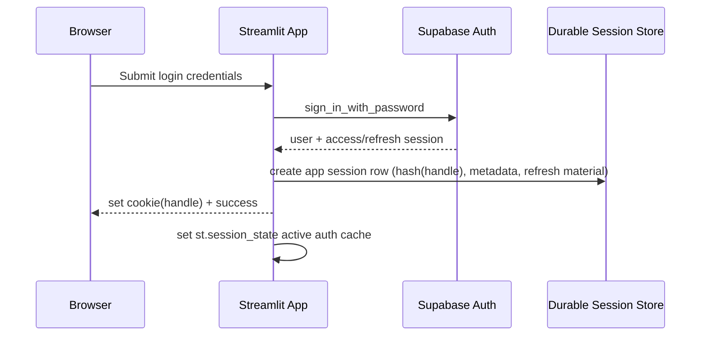
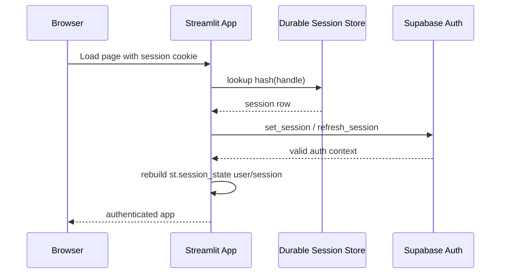
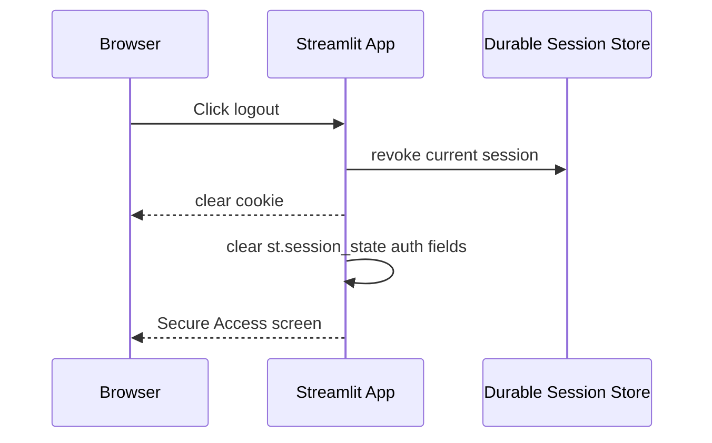
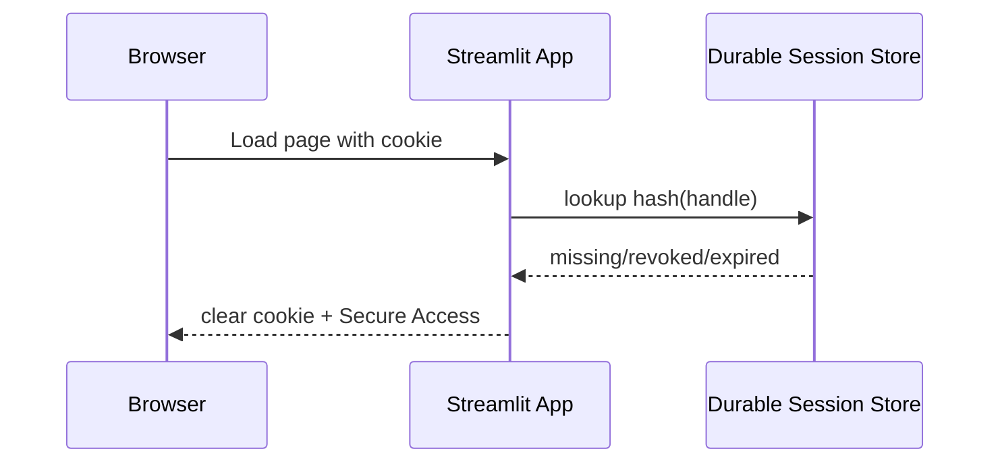
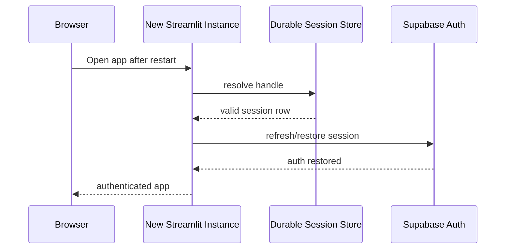

# Phase 9A.1 Session Architecture Specification

Status: Specification only. No implementation/migration changes in this phase.

## Objective
Provide production-grade durable authentication session persistence using:
- Supabase Auth as identity source of truth
- Durable Supabase-backed application session store
- Opaque browser cookie session handle
- `st.session_state` as active runtime cache only
- No in-memory cache as primary persistence

## Target Components
1. Supabase Auth
   - User identity, login credentials, token issuance, token refresh semantics
2. Application Session Store (durable)
   - Stores app-session records keyed by handle hash
   - Stores refresh material only if required for restoration
3. Browser Cookie
   - Opaque session handle only
4. Runtime Cache (`st.session_state`)
   - Fast active request/session state for current run

## Session Contract

### Expiration Model
- Sliding expiration with absolute max cap
- Recommended defaults:
  - Idle timeout (sliding): 12 hours
  - Absolute maximum lifetime: 30 days

### Remember Me
- Optional behavior:
  - Off: default short duration (12h idle, 7d absolute)
  - On: extended duration (72h idle, 30d absolute)

### Concurrent Session Policy
- Default max concurrent sessions per user: 5
- New session creation beyond max revokes oldest active session(s)

### Rotation Policy
- Rotate session handle on:
  - login success
  - refresh-token renewal boundary (periodic)
  - privilege-sensitive events (password change/reset, account security events)

### Logout Scope
- Current session logout: revoke one session record + clear cookie
- Logout-all: revoke all active sessions for user

### Activity Update Policy
- Update `last_seen_at` at most once per 5 minutes per session (write throttling)

### Cleanup and Retention
- Expired/revoked rows retained for 7-30 days (audit window), then purged
- Purge job can be scheduled or run opportunistically at startup

### Administrative Revocation
- Admin can revoke one session or all sessions for user
- Revocation reason required

## Proposed Durable Session Table (spec-level only)

Table name (proposed): `app_auth_sessions`

Proposed fields:
- `id` (uuid, primary key)
- `session_handle_hash` (text, unique, indexed)
- `user_id` (uuid/text, indexed, references auth user id)
- `created_at` (timestamp)
- `last_seen_at` (timestamp)
- `expires_at` (timestamp)
- `absolute_expires_at` (timestamp)
- `revoked_at` (timestamp nullable)
- `revocation_reason` (text nullable)
- `rotation_parent_id` (uuid nullable)
- `rotated_at` (timestamp nullable)
- `client_fingerprint_hash` (text nullable)
- `user_agent` (text nullable, truncated)
- `ip_hash` (text nullable)
- `refresh_material_encrypted` (text nullable, only if required)
- `refresh_material_kid` (text nullable)
- `metadata_json` (json nullable)

Indexes (conceptual):
- unique(session_handle_hash)
- (user_id, revoked_at, expires_at)
- (expires_at)

Notes:
- Store handle hash, not raw handle.
- Encrypt refresh material if persisted.
- Avoid storing raw IP address; prefer hash where possible.

## Full Session Lifecycle

### 1) Successful Login
1. User submits credentials.
2. Supabase Auth validates and returns session/user.
3. App creates durable app session row.
4. App issues cookie containing opaque handle.
5. App writes active runtime cache into `st.session_state`.

### 2) Session Creation
- Generate random high-entropy handle.
- Persist hash(handle) and session metadata in table.
- Optionally persist encrypted refresh material (required for restart restoration).

### 3) Cookie Issuance
- Cookie payload: opaque handle only.
- Flags: `Secure` in production, `SameSite=Lax`, path `/`.
- HttpOnly if infrastructure supports it; otherwise non-HttpOnly risk is mitigated by opaque handle design + XSS hardening.

### 4) Startup Rehydration
1. Read cookie handle.
2. Lookup session row by hash(handle).
3. Validate not revoked and not expired.
4. Restore Supabase session via stored refresh material (`set_session`/`refresh_session`).
5. Populate `st.session_state` user/session.
6. Throttled `last_seen_at` update.

### 5) Access Token Refresh
- If access token stale, refresh using retained refresh material.
- On refresh success, update session metadata and optionally rotate handle.
- On refresh failure, revoke session and clear cookie.

### 6) Browser Refresh
- Runtime state may reset; cookie + durable table enable rehydration.

### 7) Browser Close/Reopen
- Same as refresh while cookie valid and session not revoked/expired.

### 8) Streamlit Restart/Redeploy
- In-memory caches lost.
- Durable table + cookie still allow rehydration.

### 9) Multi-instance Routing
- Any instance can validate handle and rehydrate from shared table.

### 10) Logout
- Revoke current session row.
- Clear cookie.
- Clear runtime `st.session_state` auth fields.

### 11) Expiration
- If `expires_at` or `absolute_expires_at` passed: deny rehydration, clear cookie.

### 12) Revocation
- Revoked rows are never rehydrated.
- Return user to Secure Access.

### 13) Password Reset / Password Change
- Default security posture: revoke all sessions for user on password security events.
- Require re-login.

### 14) Account Disablement
- Account status check during rehydration/login blocks access and revokes active sessions.

### 15) Invalid/Malformed Cookie
- Fail closed.
- Clear cookie and show Secure Access.

### 16) Missing/Revoked/Expired Session Row
- Fail closed.
- Clear cookie and show Secure Access.

## Sequence Diagrams

### Login and Session Creation

### Reload and Rehydration

### Logout and Revocation

### Expired/Invalid Session

### Restart Recovery

## Architecture Decision
Primary persistence must be durable session store + cookie handle. `st.session_state` remains runtime cache only.
